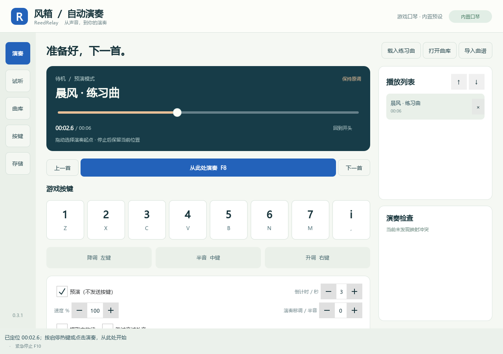
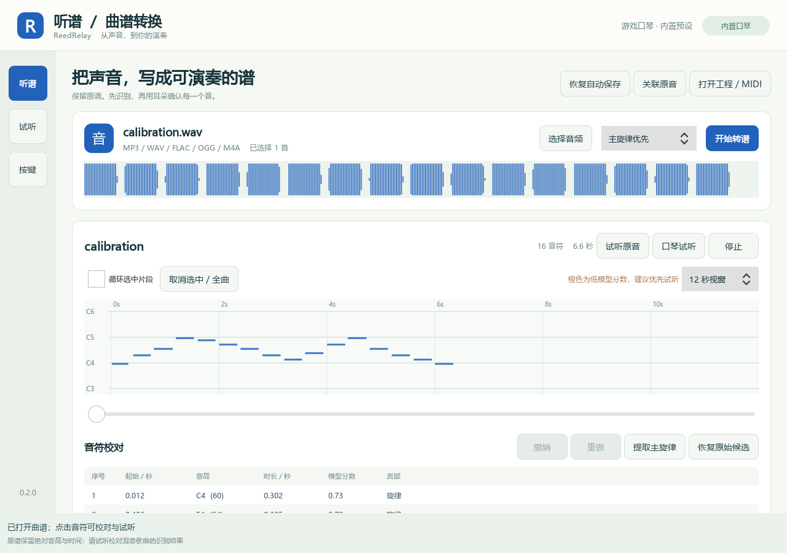
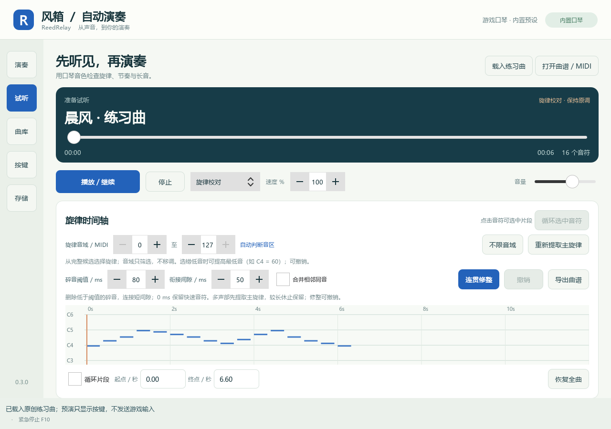
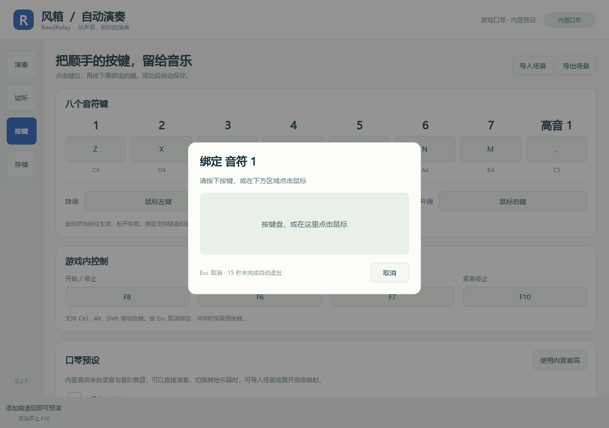
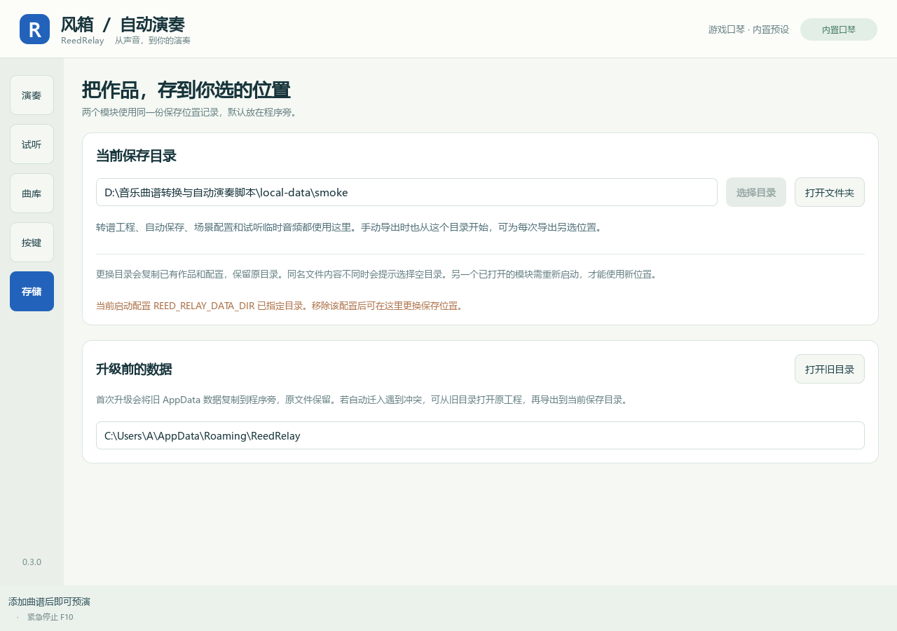
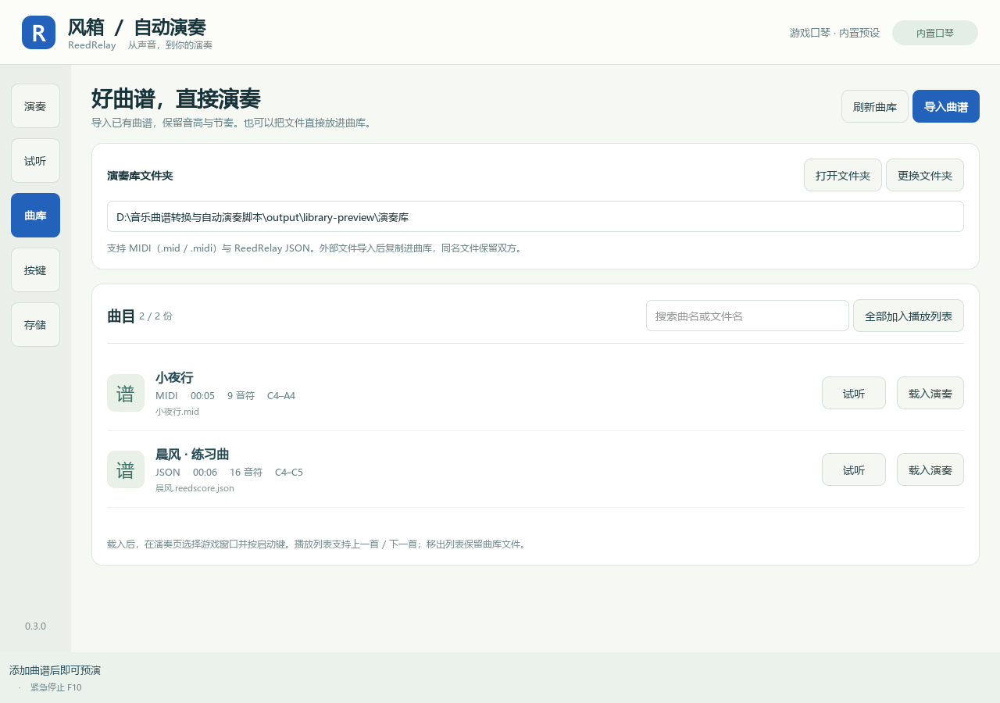

# ReedRelay · 听谱与风箱

将音频转成保留原调的可编辑曲谱，并通过自定义键位在游戏中自动演奏的 Windows 双模块桌面工具。采用 A「谱台」的冷纸色与蓝墨界面。

| 听谱 · Converter | 风箱 · Player |
|---|---|
| MP3 / WAV / FLAC / OGG / M4A 批量转谱 | 独立读取曲谱 JSON / MIDI |
| 本地 Basic Pitch ONNX 推断，全曲处理 | 全局启停、上一首、下一首、紧急停止 |
| 原始候选保留、主旋律草稿、钢琴卷帘校对 | 键盘与鼠标长按映射、播放列表、预演 |
| 原音/曲谱试听、增删拆合、撤销与自动保存 | 目标窗口守卫、停止时释放按键 |
| JSON / MIDI / 固定调简谱导出 | 内置口琴音高、点击绑定、自定义场景配置 |

两者可分别安装和启动，通过 `.reedscore.json` 交换结果。风箱不加载转谱模型；听谱无需启动游戏。

**0.3 新增**：共享「曲库」页面，导入、搜索与直接试听已有 MIDI/JSON 曲谱，风箱一键加入播放列表。用户当前的 `样例文件/示例曲谱` 作为演奏库；可更换目录。导入复制文件，相同内容复用，同名不同内容保留编号副本，原音高与时间不改。

**0.3.1 新增**：风箱演奏进度可拖动，选好位置后按启停热键从该处开始。停止保留位置，可继续或「回到开头」；切歌重置起点，长音中部和休止都按原谱剩余时间演奏，变速不移调。

**0.2 新增**：两个模块都有口琴曲谱试听，支持暂停、定位、循环与保持音高的变速；键位点击后直接捕获并保存。内置口琴预设替代调音流程，原调音页和引导入口已移除。连续换音不安排换气，单个长音可保留或选择分段重奏。

**0.2.1 修正**：主旋律提取考虑连续性，减少候选交接造成的碎音；已有曲谱可调阈值进行连贯修整并撤销。新增「存储」页选择保存目录，默认数据放在程序旁，旧 AppData 数据复制迁入并保留原文件。程序位于 C 盘且尚未选过目录时，先提示选择保存位置。

**0.2.2 修正**：主旋律增加局部音区和休止判断，减少强低音接管；两个模块可限定旋律音域，从完整候选重新提取并撤销。新转谱按 MIDI 半音发声，保留粗略滑音数据供分析；旧 Basic Pitch 工程重新提取时修正可确认的模型音分偏移。参考项目与《春日影》对照见 [转谱研究记录](docs/TRANSCRIPTION_STUDY.md)。

**原调与准确性**：默认不移调或自动折叠八度；保留完整原始候选与绝对时间。混音歌曲的自动识别可能错音、漏音或混入伴奏，需要试听校对。“主旋律”是可编辑的单声部草稿，不保证等同于人声旋律。单音游戏乐器无法完整复现和弦或连续滑音，软件会列出冲突与音域问题。

## 实际界面








截图来自实际运行程序，展示项目原创练习曲。

## 安装与启动

Windows 10/11，64 位 Python 3.12 推荐（支持范围 3.10–3.13；当前验证环境为 3.12）。在仓库目录的 PowerShell 中执行：

```powershell
# 安装两个模块；只需要风箱时改为 -Module player
.\setup.ps1 -Module all

# 可指定 Python 位置与代理
.\setup.ps1 -Module all -PythonPath 'C:\Python312\python.exe' -Proxy 'http://127.0.0.1:7897'
```

若 PowerShell 的本地脚本策略阻止运行，可对本次安装使用 `powershell -ExecutionPolicy Bypass -File .\setup.ps1 -Module all`。

安装后双击根目录的 **启动听谱.cmd** 或 **启动风箱.cmd**，也可分别运行：

```powershell
.\.venv\Scripts\reed-converter.exe
.\.venv\Scripts\reed-player.exe
```

首次安装需要下载依赖；安装完成后转谱模型在本机运行，不上传音频。Basic Pitch 使用随包提供的 ONNX 模型，安装脚本已处理其 TensorFlow 依赖声明与实际 ONNX 运行依赖的差异。

## 三步使用

1. **听谱**：选择或拖入音频，选择完整候选或主旋律草稿，开始转谱。点击音符试听和修改，保存 `.reedscore.json`。原始候选可恢复；页面下方包含编辑、问题定位和导出操作，可滚动查看。
2. **试听与按键**：打开「试听」用口琴检查曲谱；打开「按键」，点击键位后直接按下新键即可保存。内置 C4–C5、−12 / +1 / +12 预设来自录音与音阶推断，可直接使用；其他乐器可导入场景或编辑高级映射。
3. **风箱**：添加曲谱，先预演并处理问题；拖动进度条可选择演奏起点。选择游戏窗口，关闭预演，回到游戏按 F8 开始；停止保留位置，再按 F8 继续。停止和失焦会释放程序按下的按键。

已有别人做好的曲谱：打开「曲库」→「导入曲谱」（支持多选或拖入 MIDI / ReedRelay JSON）→「试听」或「载入演奏」。当前演奏库是 `样例文件/示例曲谱`；直接把文件放进该目录后点击「刷新曲库」也能使用。风箱的「全部加入播放列表」便于 F6/F7 切歌，移出播放列表不删除文件。无需运行音频转谱模型。

已有曲谱听起来碎：打开「试听」，先用默认的 **80 ms 碎音阈值 / 50 ms 衔接间隙**，点击「连贯修整」再试听。快速装饰音较多时降低阈值或设为 0；修整可撤销，点击「导出曲谱」保存结果。「重新提取主旋律」用完整候选重新生成草稿，也可撤销。

旋律选成低音：打开「听谱」或「试听」→「重新提取主旋律」。必要时提高「旋律音域」最低音（C4 = MIDI 60），再重新提取；「不限音域」恢复自动判断。筛选不升高或降低音符。去人声文件可能同时移除了目标旋律；想演奏歌声部分，优先使用含人声原曲，或直接打开可信 MIDI。

保存到其他盘：打开「存储」→「选择目录」。转谱工程、自动保存、场景和试听缓存一起使用选定目录，已有数据复制过去，原目录保留。另一个已打开的模块需重启以读取新位置。默认位置记录为程序旁的 `storage-location.json`，本地启动与构建共用该记录。

| 默认操作 | 按键 |
|---|---|
| 1 / 2 / 3 / 4 / 5 / 6 / 7 / 高音 1 | Z / X / C / V / B / N / M / 逗号 |
| 降调 / 半音 / 升调 | 鼠标左键 / 中键 / 右键（按住生效） |
| 启动 / 停止 | F8 |
| 上一首 / 下一首 | F6 / F7 |
| 紧急停止 | F10 |

这些键位都可修改，热键支持 `CTRL+F8` 等组合。F12 是 Windows 调试器保留热键，不可用作全局热键。

**口琴试听**：「旋律校对」使用稳定音准与采样推算的口琴音色；「游戏效果」应用演奏映射和长音选项，模拟起音、音准和持续发声变化。未录音符由邻近音区推算；试听不代表每个游戏音都已经实测。

**单音时长**：按键即刻发声，连续切换音符不会累积气息问题，不插入统一换气间隔。单音实际持续超过约三秒时提示可能抖动；默认保留时值，可选分段重奏会重新起音。同音重按间隔可调，后音起始节拍不变。

详细操作、音色来源、数据位置及排障见 **[使用手册](docs/USER_GUIDE.md)**。

## 开发、验证与打包

```powershell
.\.venv\Scripts\python.exe -m pip install -e '.[converter,dev]'
.\.venv\Scripts\python.exe -m pip install --no-deps basic-pitch==0.4.0
.\.venv\Scripts\python.exe -m pytest -q
.\build.ps1 -Module all
.\packaging\smoke.ps1
```

独立程序输出到 `dist/ReedRelay-Player/` 与 `dist/ReedRelay-Converter/`，各目录中 EXE 与 `_internal` 必须一起保留。可只打包其中一个模块。便携包启动不需要安装 Python，也不需要另一个模块。

当前验证包含已知音高/时间、60 秒后音符对齐、编辑恢复、按键释放、按键捕获与保存回滚、原调变速试听、样例 MP3 全曲转写、独立 EXE 启动及转换。详见 [阶段记录](docs/PROGRESS.md)。实际游戏输入与音色效果仍需在游戏会话中确认。

## 文档与范围

- [实施方案](design/方案.md) · [曲谱格式](docs/FORMAT.md) · [第三方组件](docs/THIRD_PARTY.md)
- 首版不包含 Demucs 声部分离、MusicXML/PDF 排版、自动拍号/调式识别。
- 本地样例音频与派生曲谱、用户配置、转写模型和构建产物不提交 Git；仓库内含从干净录音提取的口琴合成参数及提取脚本，不含原录音。
- 项目暂未指定开源许可证；依赖保留各自许可证。当前提供源码和本地可运行构建，尚未发布公共二进制 GitHub Release。
