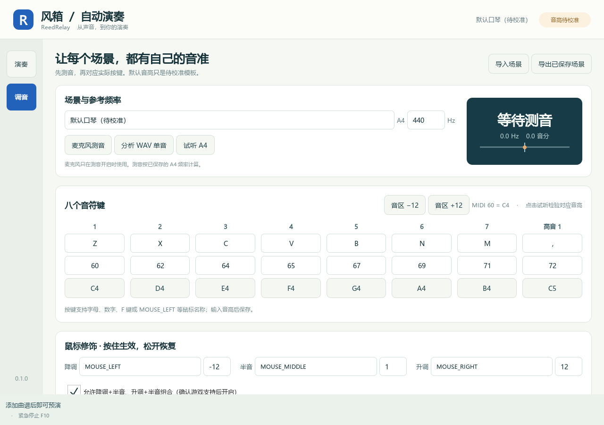

# ReedRelay · 听谱与风箱

将音频转成保留原调的可编辑曲谱，并通过自定义键位在游戏中自动演奏的 Windows 双模块桌面工具。采用 A「谱台」的冷纸色与蓝墨界面。

| 听谱 · Converter | 风箱 · Player |
|---|---|
| MP3 / WAV / FLAC / OGG / M4A 批量转谱 | 独立读取曲谱 JSON / MIDI |
| 本地 Basic Pitch ONNX 推断，全曲处理 | 全局启停、上一首、下一首、紧急停止 |
| 原始候选保留、主旋律草稿、钢琴卷帘校对 | 键盘与鼠标长按映射、播放列表、预演 |
| 原音/曲谱试听、增删拆合、撤销与自动保存 | 目标窗口守卫、停止时释放按键 |
| JSON / MIDI / 固定调简谱导出 | 麦克风/录音调音、自定义场景配置 |

两者可分别安装和启动，通过 `.reedscore.json` 交换结果。风箱不加载转谱模型；听谱无需启动游戏。

**原调与准确性**：默认不移调或自动折叠八度；保留完整原始候选与绝对时间。混音歌曲的自动识别可能错音、漏音或混入伴奏，需要试听校对。“主旋律”是可编辑的单声部草稿，不保证等同于人声旋律。单音游戏乐器无法完整复现和弦或连续滑音，软件会列出冲突与音域问题。

## 实际界面




截图来自实际运行程序，展示项目原创练习曲。

## 安装与启动

Windows 10/11，64 位 Python 3.12 推荐（支持范围 3.10–3.13；当前验证环境为 3.12）。在仓库目录的 PowerShell 中执行：

```powershell
# 安装两个模块；只需要风箱时改为 -Module player
.\setup.ps1 -Module all

# 可指定 Python 位置与代理
.\setup.ps1 -Module all -PythonPath 'C:\Python312\python.exe' -Proxy 'http://127.0.0.1:7897'
```

若 PowerShell 的本地脚本策略阻止运行，可对本次安装使用 `powershell -ExecutionPolicy Bypass -File .\setup.ps1 -Module all`。

安装后双击根目录的 **启动听谱.cmd** 或 **启动风箱.cmd**，也可分别运行：

```powershell
.\.venv\Scripts\reed-converter.exe
.\.venv\Scripts\reed-player.exe
```

首次安装需要下载依赖；安装完成后转谱模型在本机运行，不上传音频。Basic Pitch 使用随包提供的 ONNX 模型，安装脚本已处理其 TensorFlow 依赖声明与实际 ONNX 运行依赖的差异。

## 三步使用

1. **听谱**：选择或拖入音频，选择完整候选或主旋律草稿，开始转谱。点击音符试听和修改，保存 `.reedscore.json`。原始候选可恢复；页面下方包含编辑、问题定位和导出操作，可滚动查看。
2. **调音**：在任一模块的调音页测量游戏的基础音和鼠标修饰效果，填写实际 MIDI 音高与半音值，保存场景。出厂 C4–C5、−12 / +1 / +12 只是待校准模板。
3. **风箱**：添加曲谱，先预演并处理问题；选择游戏窗口，关闭预演，回到游戏按 F8 开始。停止和失焦会释放程序按下的按键。

| 默认操作 | 按键 |
|---|---|
| 1 / 2 / 3 / 4 / 5 / 6 / 7 / 高音 1 | Z / X / C / V / B / N / M / 逗号 |
| 降调 / 半音 / 升调 | 鼠标左键 / 中键 / 右键（按住生效） |
| 启动 / 停止 | F8 |
| 上一首 / 下一首 | F6 / F7 |
| 紧急停止 | F10 |

这些键位都可修改，热键支持 `CTRL+F8` 等组合。F12 是 Windows 调试器保留热键，不可用作全局热键。

详细操作、调音步骤、数据位置及排障见 **[使用手册](docs/USER_GUIDE.md)**。

## 开发、验证与打包

```powershell
.\.venv\Scripts\python.exe -m pip install -e '.[converter,dev]'
.\.venv\Scripts\python.exe -m pip install --no-deps basic-pitch==0.4.0
.\.venv\Scripts\python.exe -m pytest -q
.\build.ps1 -Module all
.\packaging\smoke.ps1
```

独立程序输出到 `dist/ReedRelay-Player/` 与 `dist/ReedRelay-Converter/`，各目录中 EXE 与 `_internal` 必须一起保留。可只打包其中一个模块。便携包启动不需要安装 Python，也不需要另一个模块。

当前验证包含已知音高/时间、60 秒后音符对齐、编辑恢复、按键释放、真实 Windows 热键注册、样例 MP3 全曲转写、两个独立 EXE 启动及转换。详见 [阶段记录](docs/PROGRESS.md)。真实游戏输入兼容性及麦克风硬件需在使用场景中验证。

## 文档与范围

- [实施方案](design/方案.md) · [曲谱格式](docs/FORMAT.md) · [第三方组件](docs/THIRD_PARTY.md)
- 首版不包含 Demucs 声部分离、MusicXML/PDF 排版、自动拍号/调式识别。
- 本地样例音频与派生曲谱、用户配置、模型和构建产物不提交 Git。
- 项目暂未指定开源许可证；依赖保留各自许可证。当前提供源码和本地可运行构建，尚未发布公共二进制 GitHub Release。
